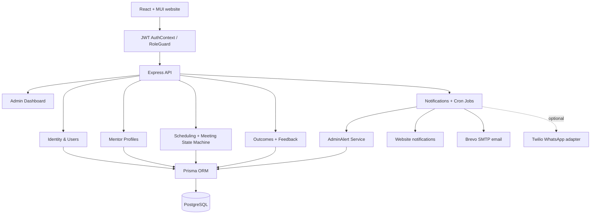

```mermaid
flowchart TD
  Browser["React + MUI website"]
  Auth["JWT AuthContext / RoleGuard"]
  Admin["Admin Dashboard"]
  API["Express API"]

  Identity["Identity & Users"]
  Mentors["Mentor Profiles"]
  Scheduling["Scheduling + Meeting State Machine"]
  Engagement["Outcomes + Feedback"]
  Comms["Notifications + Cron Jobs"]
  Alerts["AdminAlert Service"]

  Prisma["Prisma ORM"]
  PG[("PostgreSQL")]

  Browser --> Auth --> API
  API --> Identity
  API --> Mentors
  API --> Scheduling
  API --> Engagement
  API --> Comms
  API --> Admin
  Comms --> Alerts
  Identity --> Prisma
  Mentors --> Prisma
  Scheduling --> Prisma
  Engagement --> Prisma
  Alerts --> Prisma
  Prisma --> PG

  Comms --> InApp["Website notifications"]
  Comms --> Email["Brevo SMTP email"]
  Comms -. optional .-> WhatsApp["Twilio WhatsApp adapter"]
```
