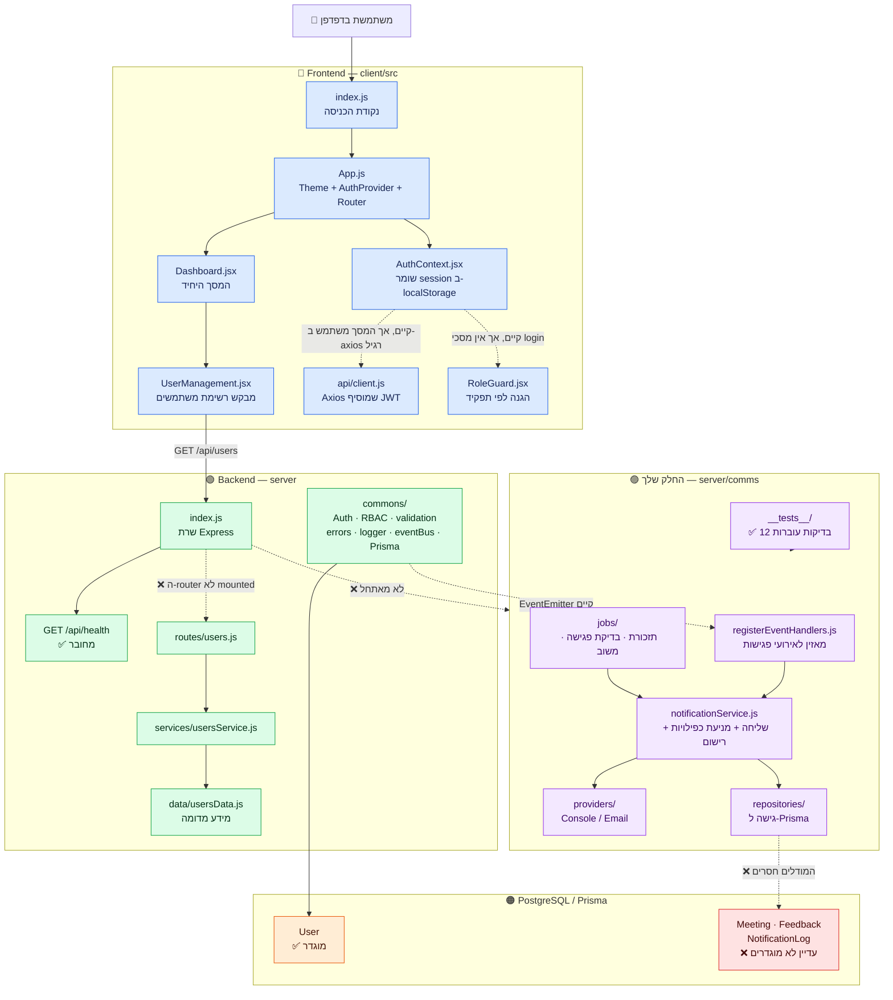

```mermaid
flowchart TB
    U["👩 משתמשת בדפדפן"]

    subgraph FE["🔵 Frontend — client/src"]
        IDX["index.js<br/>נקודת הכניסה"]
        APP["App.js<br/>Theme + AuthProvider + Router"]
        DASH["Dashboard.jsx<br/>המסך היחיד"]
        USERSUI["UserManagement.jsx<br/>מבקש רשימת משתמשים"]
        AUTHCTX["AuthContext.jsx<br/>שומר session ב-localStorage"]
        APIC["api/client.js<br/>Axios שמוסיף JWT"]
        GUARD["RoleGuard.jsx<br/>הגנה לפי תפקיד"]
    end

    subgraph BE["🟢 Backend — server"]
        SERVER["index.js<br/>שרת Express"]
        HEALTH["GET /api/health<br/>✅ מחובר"]
        COMMONS["commons/<br/>Auth · RBAC · validation<br/>errors · logger · eventBus · Prisma"]
        USERROUTE["routes/users.js"]
        USERSERVICE["services/usersService.js"]
        MOCK["data/usersData.js<br/>מידע מדומה"]
    end

    subgraph COMMS["🟣 החלק שלך — server/comms"]
        EVENTS["registerEventHandlers.js<br/>מאזין לאירועי פגישות"]
        SERVICE["notificationService.js<br/>שליחה + מניעת כפילויות + רישום"]
        PROVIDERS["providers/<br/>Console / Email"]
        JOBS["jobs/<br/>תזכורת · בדיקת פגישה · משוב"]
        REPOS["repositories/<br/>גישה ל-Prisma"]
        TESTS["__tests__/<br/>✅ 12 בדיקות עוברות"]
    end

    subgraph DB["🟠 PostgreSQL / Prisma"]
        USERDB["User<br/>✅ מוגדר"]
        MISSING["Meeting · Feedback<br/>NotificationLog<br/>❌ עדיין לא מוגדרים"]
    end

    U --> IDX --> APP --> DASH --> USERSUI
    APP --> AUTHCTX
    USERSUI -->|"GET /api/users"| SERVER
    SERVER --> HEALTH

    USERROUTE --> USERSERVICE --> MOCK
    SERVER -. "❌ ה-router לא mounted" .-> USERROUTE

    AUTHCTX -. "קיים, אך אין מסכי login" .-> GUARD
    AUTHCTX -. "קיים, אך המסך משתמש ב-axios רגיל" .-> APIC

    SERVER -. "❌ לא מאתחל" .-> COMMS
    COMMONS -. "EventEmitter קיים" .-> EVENTS
    EVENTS --> SERVICE --> PROVIDERS
    JOBS --> SERVICE
    SERVICE --> REPOS
    REPOS -. "❌ המודלים חסרים" .-> MISSING
    TESTS --> COMMS
    COMMONS --> USERDB

    classDef frontend fill:#dbeafe,stroke:#2563eb,color:#172554
    classDef backend fill:#dcfce7,stroke:#16a34a,color:#052e16
    classDef comms fill:#f3e8ff,stroke:#9333ea,color:#3b0764
    classDef database fill:#ffedd5,stroke:#ea580c,color:#431407
    classDef missing fill:#fee2e2,stroke:#dc2626,color:#450a0a

    class IDX,APP,DASH,USERSUI,AUTHCTX,APIC,GUARD frontend
    class SERVER,HEALTH,COMMONS,USERROUTE,USERSERVICE,MOCK backend
    class EVENTS,SERVICE,PROVIDERS,JOBS,REPOS,TESTS comms
    class USERDB database
    class MISSING missing
```

