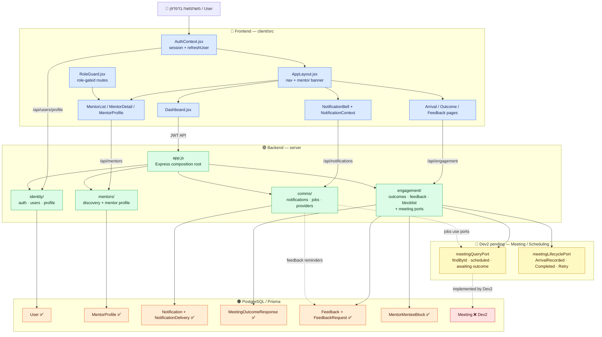

```mermaid
flowchart TB
    U["👩 משתמשת בדפדפן / User"]

    subgraph FE["🔵 Frontend — client/src"]
        AUTHCTX["AuthContext.jsx<br/>session + refreshUser"]
        GUARD["RoleGuard.jsx<br/>role-gated routes"]
        LAYOUT["AppLayout.jsx<br/>nav + mentor banner"]
        DASH["Dashboard.jsx"]
        MENTORSUI["MentorList / MentorDetail / MentorProfile"]
        NOTIFUI["NotificationBell + NotificationContext"]
        ENGAGEUI["Arrival / Outcome / Feedback pages"]
    end

    subgraph BE["🟢 Backend — server"]
        APP["app.js<br/>Express composition root"]
        IDENTITY["identity/<br/>auth · users · profile"]
        MENTORS["mentors/<br/>discovery + mentor profile"]
        ENGAGE["engagement/<br/>outcomes · feedback · blocklist<br/>+ meeting ports"]
        COMMS["comms/<br/>notifications · jobs · providers"]
    end

    subgraph PORTS["🔌 Dev2 pending — Meeting / Scheduling"]
        MQ["meetingQueryPort<br/>findById · scheduled · awaiting outcome"]
        ML["meetingLifecyclePort<br/>ArrivalRecorded · Completed · Retry"]
    end

    subgraph DB["🟠 PostgreSQL / Prisma"]
        USERDB["User ✅"]
        MENTORDB["MentorProfile ✅"]
        NOTIFDB["Notification + NotificationDelivery ✅"]
        OUTDB["MeetingOutcomeResponse ✅"]
        FBDB["Feedback + FeedbackRequest ✅"]
        BLOCKDB["MentorMenteeBlock ✅"]
        MEETINGDB["Meeting ❌ Dev2"]
    end

    U --> AUTHCTX --> LAYOUT --> DASH
    LAYOUT --> MENTORSUI
    LAYOUT --> NOTIFUI
    LAYOUT --> ENGAGEUI
    GUARD --> MENTORSUI

    DASH -->|"JWT API"| APP
    MENTORSUI -->|"/api/mentors"| MENTORS
    NOTIFUI -->|"/api/notifications"| COMMS
    ENGAGEUI -->|"/api/engagement"| ENGAGE
    AUTHCTX -->|"/api/users/profile"| IDENTITY

    APP --> IDENTITY
    APP --> MENTORS
    APP --> ENGAGE
    APP --> COMMS

    ENGAGE --> MQ
    ENGAGE --> ML
    ENGAGE --> OUTDB
    ENGAGE --> FBDB
    ENGAGE --> BLOCKDB
    COMMS --> NOTIFDB
    COMMS -. "jobs use ports" .-> MQ
    COMMS -. "feedback reminders" .-> FBDB
    IDENTITY --> USERDB
    MENTORS --> MENTORDB
    MQ -. "implemented by Dev2" .-> MEETINGDB

    classDef frontend fill:#dbeafe,stroke:#2563eb,color:#172554
    classDef backend fill:#dcfce7,stroke:#16a34a,color:#052e16
    classDef ports fill:#fef9c3,stroke:#ca8a04,color:#422006
    classDef database fill:#ffedd5,stroke:#ea580c,color:#431407
    classDef pending fill:#fee2e2,stroke:#dc2626,color:#450a0a

    class AUTHCTX,GUARD,LAYOUT,DASH,MENTORSUI,NOTIFUI,ENGAGEUI frontend
    class APP,IDENTITY,MENTORS,ENGAGE,COMMS backend
    class MQ,ML ports
    class USERDB,MENTORDB,NOTIFDB,OUTDB,FBDB,BLOCKDB database
    class MEETINGDB pending
```
